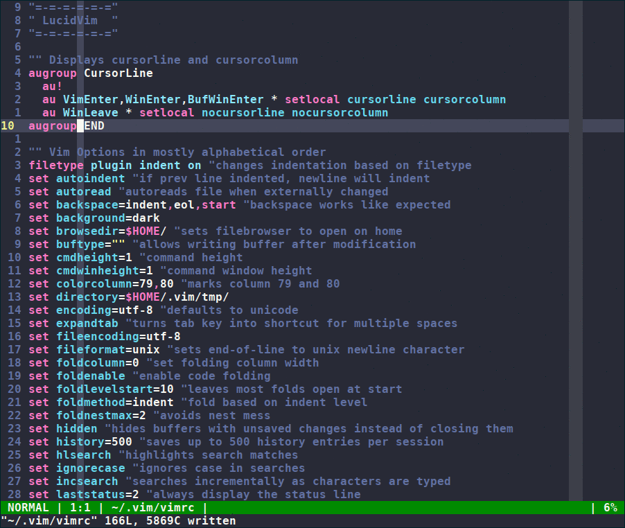

# LucidVim

LucidVim is an out-of-the-box vim distribution for programmers. It aims to
provide all the tools expected from a modern programmer's text editor without
IDE-ifying it. The design philosophy for the project is function over form and
is heavily inspired by the 
[unix philosophy](http://www.catb.org/esr/writings/taoup/html/ch01s06.html)
 and the [suckless philosophy](https://suckless.org/philosophy).

## Features
* Clean and informative interface
* Key mappings for easier buffer/window creation and navigation
* Key mappings for newrw (vim's built-in file explorer)
* Configured to support many new and useful features of Vim8
* Sane config settings
* Aims not to diverge too much from vanilla vim while increasing usability and
  functionality
* Completely plugin free
* Simple statusbar that adapts color to the mode and uses a minimal code base

## What LucidVim is Not
* It's not a Virtual Machine (see: emacs). It isn't a planner, calendar, browser, 
or any other extension that others may desire to tack on to it.
* It's not an IDE (see: nvim). Our philosophy is about avoiding feature creep
  and utilizing vim's strengths as a text editor.
* It's not a plugin circus. So many solutions to making
  vim more usable involve boatloads of plugins and custom config files that
  stray far from vanilla behavior. We don't aim to reshape vim into some new
  editor, but to let the vim experience shine with our added useability
  features and settings.

## Installation
Prerequisite - Have [vim8](https://github.com/vim/vim) or higher installed. For best results,
edit vim8's src/Makefile to your liking and compile.

After installing vim, simply copy the .vim directory into your home directory.

## Help
* [Tutorials and Further Information](https://elucid8.github.io/lucidvim)

* [Find a bug?](https://github.com/elucid8/lucidvim/issues/new)
